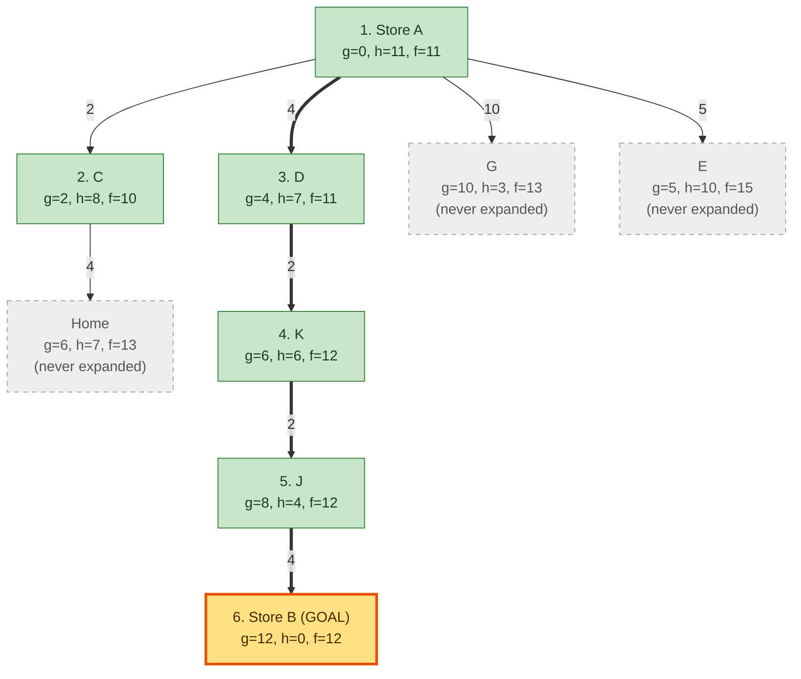
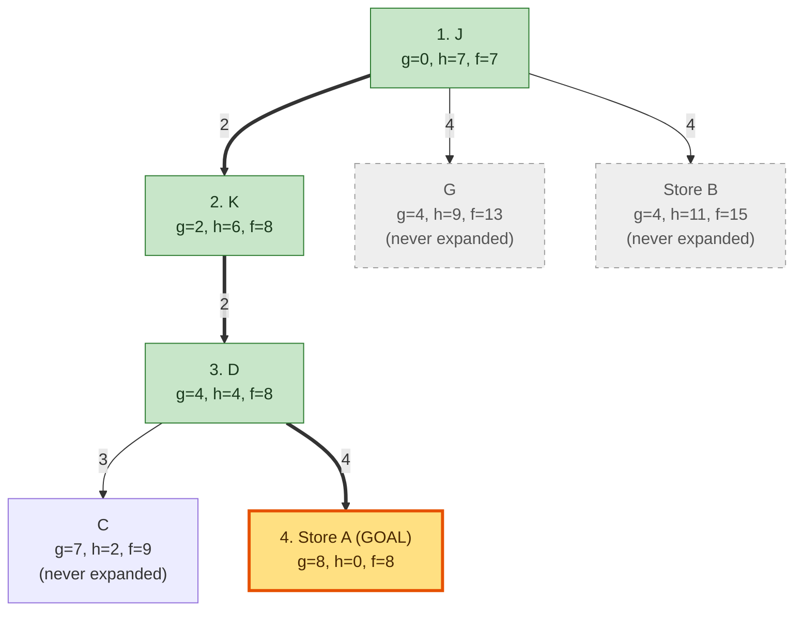

# Assignment 1 — Written Tasks (A* Search)

Graph: Figure 3, heuristics from Figure 4.

Edge weights: Home–C 4, Home–E 3, Home–F 2, C–E 3, C–Store A 2, C–D 3, E–F 6,
E–Store A 5, Store A–D 4, Store A–G 10, D–K 2, K–J 2, K–G 12, G–J 4, G–Store B 3,
F–G 7, F–Store B 5, Store B–J 4.

A* expands the frontier node with the lowest f(n) = g(n) + h(n), breaking ties
alphabetically. The search stops when the goal is *expanded*, not merely added
to the frontier.

## Task 4: A* from Store A to Store B

Uses the **h(n): Store B** column.

**Step 1 — Expand Store A** (g=0, f=0+11=11). Add its neighbors:

| Node | g | h | f |
|---|---|---|---|
| C | 2 | 8 | **10** |
| D | 4 | 7 | 11 |
| G | 10 | 3 | 13 |
| E | 5 | 10 | 15 |

**Step 2 — Expand C** (f=10, lowest). New reachable node: Home (g=6, h=7, f=13).
Going C→D would cost g=5, f=12, worse than D's existing f=11, so D keeps its old
value. Frontier: **D(11)**, G(13), Home(13), E(15).

**Step 3 — Expand D** (f=11). Adds K: g=4+2=6, h=6, f=12.
Frontier: **K(12)**, G(13), Home(13), E(15).

**Step 4 — Expand K** (f=12). Adds J: g=6+2=8, h=4, f=12. (K→G gives g=18, f=21 —
worse than G's 13.) Frontier: **J(12)**, G(13), Home(13), E(15).

**Step 5 — Expand J** (f=12). Adds Store B: g=8+4=12, h=0, f=12. (J→G gives f=15 —
worse.) Frontier: **Store B(12)**, G(13), Home(13), E(15).

**Step 6 — Expand Store B** (f=12) → goal reached.

**Search sequence:** Store A, C, D, K, J, Store B

**Optimal path:** Store A → D → K → J → Store B, **cost = 4+2+2+4 = 12**

(Sanity check: the direct route Store A → G → Store B costs 10+3 = 13, so 12 is optimal.)

### Search tree

## Task 5: A* from J to Store A

Uses the **h(n): Store A** column.

**Step 1 — Expand J** (g=0, f=0+7=7). Add its neighbors:

| Node | g | h | f |
|---|---|---|---|
| K | 2 | 6 | **8** |
| G | 4 | 9 | 13 |
| Store B | 4 | 11 | 15 |

**Step 2 — Expand K** (f=8). Adds D: g=2+2=4, h=4, f=8. (K→G gives g=14 — worse
than G's g=4.) Frontier: **D(8)**, G(13), Store B(15).

**Step 3 — Expand D** (f=8). Adds Store A: g=4+4=8, h=0, f=8, and C: g=7, h=2, f=9.
Frontier: **Store A(8)**, C(9), G(13), Store B(15).

**Step 4 — Expand Store A** (f=8) → goal reached.

**Search sequence:** J, K, D, Store A

**Optimal path:** J → K → D → Store A, **cost = 2+2+4 = 8**

(Sanity check: J → G → Store A costs 4+10 = 14, so 8 is optimal.)

### Search tree

